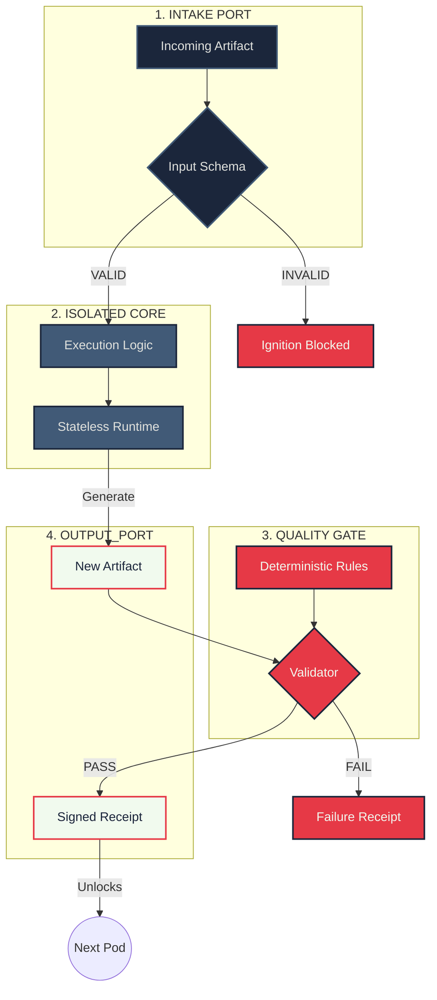

# The Anatomy of a Pod

This diagram provides a high-resolution "blueprint" of a single PodChain Execution Node. 

Every Pod is an isolated, deterministic factory unit. It does not possess a "brain" or memory; it only possesses **structure**.

## Component Breakdown

### 1. The Intake Port (The Contract)
- **What it is:** A strict schema filter.
- **Function:** It intercepts the incoming artifact and verifies that every required field is present and correctly typed.
- **The "Why":** It ensures that the Worker Core never attempts to process "garbage" or incomplete data.

### 2. The Isolated Core (The Worker)
- **What it is:** The compute engine (Python, LLM, SQL).
- **Function:** It executes the transformation logic. It is "stateless," meaning it starts from zero every time and only knows what is in the Intake Port.
- **The "Why":** It eliminates "drift." The AI cannot remember previous conversations or get confused by past states.

### 3. The Quality Gate (The Sensor)
- **What it is:** An objective verification layer.
- **Function:** It subjects the output to a battery of tests (Syntax, Regex, Logical checks).
- **The "Why":** It decouples "doing the work" from "checking the work." The Worker can hallucinate, but the Sensor is a hard-coded script that cannot be fooled.

### 4. The Output Port (The Receipt)
- **What it is:** The termination and interlock point.
- **Function:** It packages the new artifact and issues a JSON receipt.
- **The "Why":** The Receipt is the "Key" for the next Pod. Without a `PASS` receipt, the next node's Intake Port remains physically locked.

---
*Architected by Amit Bhatia*
