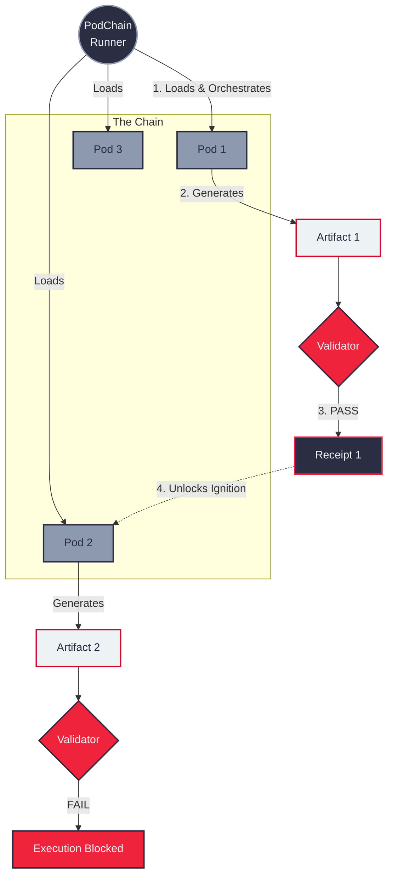

# PodChain Architecture

The system consists of three main layers:

1. **The Runner:** Responsible for loading pod definitions, executing logic, and managing the lifecycle.
2. **The Validator:** Responsible for checking artifacts against rules defined in the pod template.
3. **The Ledger:** A collection of receipts that form the audit trail (the "Chain").

## System Diagram

## Execution Flow
1. **Load:** Runner reads `pod.yaml` and `input.yaml`.
2. **Pre-flight:** Validator checks if dependencies (previous artifacts) are valid.
3. **Execute:** The pod's `run.py` is invoked.
4. **Post-flight:** Validator inspects the new artifact.
5. **Finalize:** Runner writes `receipt.json`.
