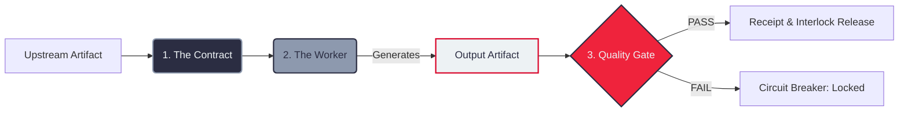

# The Pod: Stateless Execution Unit

In PodChain, a **Pod** is fundamentally different from an "AI Agent." 

An agent operates in an autonomous loop—thinking, acting, and observing. This autonomy introduces the risk of hallucination, drift, and non-deterministic state.

A **Pod is a stateless execution node**. It is a precision tool on an industrial assembly line. It consists of exactly three functional components:

## The Three Components of a Pod

### 1. The Contract (Input Schema)
A Pod does not "decide" its operational parameters. It only accepts a strictly defined payload. 
- **Type Safety:** If the schema requires a `user_id` and a `context_block`, the Pod will not ignite without them.
- **Protocol Enforcement:** It ensures that only valid, high-integrity data enters the execution phase.
- **Why it matters:** It prevents "garbage-in" failures from destabilizing the machine.

### 2. The Worker (Execution Logic)
This is the isolated unit where the primary logic (LLM API call, script, or query) resides.
- **Single Responsibility:** It performs **exactly one job**.
- **Pure Functionality:** It is stateless; it takes the Contract, executes the logic, and generates an Artifact.
- **Why it matters:** It isolates failure domains. You can identify exactly which operational step failed without ambiguity.

### 3. The Quality Gate (The Validator)
A Pod never trusts its own execution. Once the Worker generates an Artifact, the Quality Gate inspects it against deterministic rules.
- **Objective Verification:** It uses hard logic (Regex, Schema, Syntax check) to verify the artifact's integrity.
- **Circuit Breaking:** If the Gate returns a `FAIL`, the entire chain is locked.
- **Why it matters:** It provides an absolute barrier against error propagation.

---

## Visualizing the Pod Flow

## The Architectural Value
By enforcing this "No Brain" architecture, we move system intelligence to the **Systems Architect**. You are not "asking" an AI to behave; you are **engineering** a system that ensures compliance by design.
